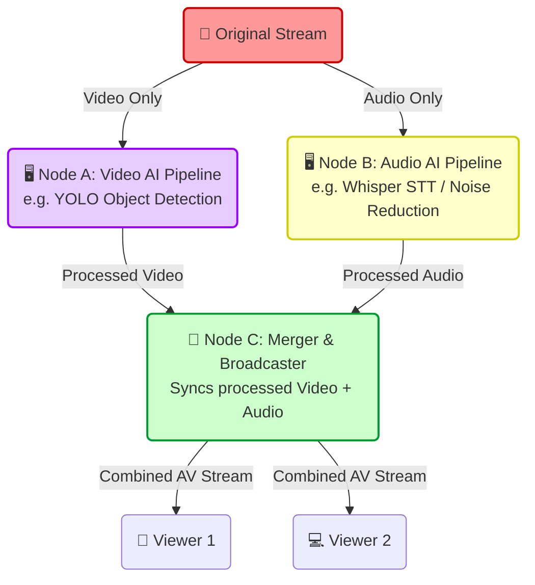
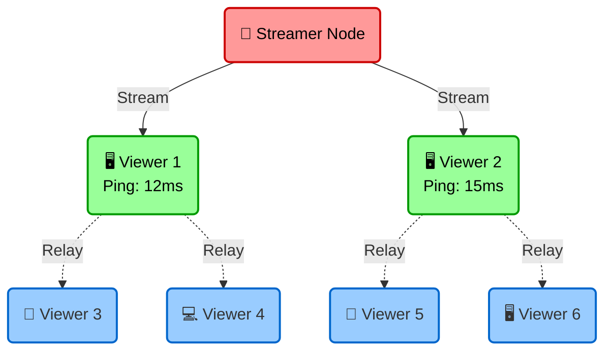

<div align="center">
  
  <h1>🌳 rtcTree</h1>
  <p><b>Advanced Auto-Balancing WebRTC Mesh Topology Manager</b></p>

  [](https://www.npmjs.com/package/webrtc-tree)
  [](https://opensource.org/licenses/MIT)
  [](https://www.typescriptlang.org/)
</div>

---

**`webrtc-tree`** is a decentralized, high-performance WebRTC topology management library engineered specifically for **Peer-to-Peer (P2P) Live Streaming** and **Video Broadcasting**. 

By utilizing an **Auto-Balancing WebRTC Mesh Network**, `webrtc-tree` intelligently offloads the streamer's upload bandwidth by distributing media streams across viewers. It is the perfect solution for building scalable, zero-cost live streaming platforms using Node.js and WebRTC.

## 🌟 Why rtcTree?
* **Cost-Efficient**: Zero media server bandwidth costs. The server only handles lightweight signaling.
* **Smart Auto-Balancing**: Periodically evaluates connection quality (Ping/Bitrate) and promotes strong nodes to the top of the tree.
* **Self-Healing**: If a parent node drops out, the mesh automatically restructures in milliseconds.
* **Media Pipeline Control**: Decouple and independently process video, audio, and data tracks before local rendering or downstream forwarding.

---

## 💡 Advanced Use Case: Distributed AI Edge Processing

Because `webrtc-tree` strictly separates **Audio**, **Video**, and **Data** pipelines, you can build an ultra-low-cost, distributed AI processing cluster using weak edge devices or standard browser clients:



By leveraging `rtcTree`'s Media Pipeline Hooks (`onIncomingVideo`, `onIncomingAudio`), you can distribute heavy AI workloads across multiple cheap machines. Node A only processes frames, Node B only processes sound, and Node C stitches them together to serve the final downstream viewers—achieving a **highly scalable, self-adaptive AI live streaming architecture** without needing expensive GPU cloud servers.

---

## 🏗️ Architecture & Topology

`rtcTree` operates on a hybrid architecture that splits the heavy lifting from the coordination:

1. **Server Coordinator (`RTCTreeCoordinator`)**: Runs on your Node.js signaling server. Maintains a structural map of the network topology and orchestrates handshakes. **It never processes or touches the actual media streams.**
2. **Client Node (`RTCTreeClient`)**: Runs in the viewer's browser. Manages the WebRTC connections, handles the media pipeline, and acts as a relay to forward streams to downstream viewers.

### The Mesh Concept


*In this topology, the streamer only uploads to a few strong "Layer 1" nodes. Those nodes automatically relay the feed to the rest of the network.*

---

## 🚀 Installation

Install via npm or yarn:

```bash
npm install webrtc-tree
# or
yarn add webrtc-tree
```

---

## 💻 Server-Side API (Coordinator)

The Coordinator must run in a Node.js backend environment to keep track of the mesh state.

### `import { RTCTreeCoordinator } from 'webrtc-tree/server';`

### `createRoom(roomId, streamerPeerId, config)`
Initializes a new streaming room topology.

```typescript
const coordinator = new RTCTreeCoordinator();

coordinator.createRoom('room_123', 'streamer_id', {
  maxNodesPerLayer: [1, 4, 16, 64],
  baseDelayMs: 1000,
  layerDelayMs: 300,
  autoBalanceStrategy: 'quality', // 'chronological' | 'quality'
  autoBalanceIntervalMs: 10000    // Evaluation interval
});
```

### Advanced Signaling Setup
To handle WebRTC handshakes seamlessly, you must hook the Coordinator into your WebSocket server:

```typescript
// Define how the server forwards signaling messages
coordinator.onSignalingMessage = (roomId, fromPeerId, toPeerId, message) => {
  io.to(toPeerId).emit('rtc-message', {
    fromPeerId: fromPeerId,
    payload: message
  });
};

// Route incoming WebSocket messages into the Coordinator
socket.on('rtc-message', (data) => {
  const { roomId, toPeerId, payload } = data;
  coordinator.handleSignaling(roomId, socket.id, toPeerId, payload);
});
```

---

## 🌐 Client-Side API (Client Node)

The Client handles the P2P connection logic in the browser environment.

### `import { RTCTreeClient } from 'webrtc-tree/client';`

### Initialization

```typescript
const client = new RTCTreeClient({
  fetchParentIdFn: async () => {
    // Call your backend API to invoke coordinator.getAssignedParent
    const response = await fetch('/api/get-parent');
    return (await response.json()).parentId;
  },
  sendMessageFn: (targetPeerId, payload) => {
    // Forward WebRTC signals (Offer/Answer/ICE) through your WebSocket
    socket.emit("rtc-message", { toPeerId: targetPeerId, payload });
  },
  onStreamReady: (stream) => {
    // Attach stream to video element when connection is successful
    videoElement.srcObject = stream;
  }
});

// Start the WebRTC Client
await client.initViewer();
```

---

## 🎛️ Media Pipeline Hooks

The pipeline allows intercepting streams at two specific stages: `Incoming` (for local display) and `Outgoing` (for forwarding). 

Provide these hooks within the `RTCTreeClient` constructor options:

```typescript
const client = new RTCTreeClient({
  // ...

  // 1. INCOMING: Modify what the local user sees/hears
  onIncomingVideo: (track) => applyLocalFilter(track),
  onIncomingAudio: (track) => {
    track.enabled = false; // Example: Mute locally
    return track;
  },
  onIncomingData: (data) => console.log('Chat message:', data),

  // 2. OUTGOING: Modify what is forwarded to downstream viewers
  onOutgoingVideo: (track) => applyBeautyFilter(track),
  onOutgoingData: (data) => {
    if (data.includes('spam')) return null; // Intercept and block forwarding
    return data;
  }
});
```

---

## ⚖️ Auto-Balancing Strategies

Define the strategy in the `RoomConfig` during `createRoom`.

### 1. `chronological` (Default)
- **Placement**: First-come, first-serve. Nodes fill layers sequentially via BFS (Breadth-First Search).
- **Healing**: If a node disconnects, a child or a newly joining node takes its place sequentially.

### 2. `quality` (Advanced)
- **Active Evaluation**: Periodically checks the Ping and Bitrate of all nodes.
- **Node Swapping**: If a downstream node exhibits significantly better network quality than an upstream node, the server swaps their positions automatically.
- **Smart Promotion**: When a node disconnects, the coordinator evaluates its children and immediately promotes the child with the best network score to assume the vacant position.

---

## 📜 License

This project is licensed under the MIT License - see the LICENSE file for details.
